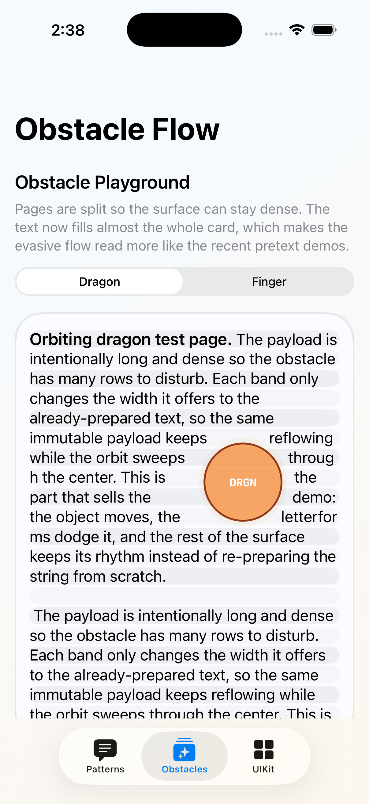

# PreparedTextDemo

This folder contains the committed iOS demo project used for Apple-platform verification of the prepared-text-ios release.

- app entry: `Sources/PreparedTextDemoApp.swift`
- root screen: `Sources/PreparedTextDemoRootView.swift`
- UIKit host: `Sources/PreparedTextUIKitHostView.swift`
- shared iOS tests: `../../Tests/PretextUIKitTests/PreparedTextUIKitTests.swift`
- committed project: `PreparedTextDemo.xcodeproj`

The demo app is not a second packaging story. It exists to verify UIKit and SwiftUI behavior on a real Apple runtime before release.
Its XCTest gate covers the supported simulator baseline subset while the broader host stable corpus remains in the SwiftPM validation runner.

The current showcase also includes narrow public differentiators that sit on top of the prepared layout engine:

- prepared structure inspection with inline attachment, link, mention, and hashtag content
- source-coordinate-map-driven visible span inspection
- circle-obstacle exclusion layout for read-only prepared surfaces

## Open in Xcode

```bash
open PreparedTextDemo.xcodeproj
```

## Build and test with xcodebuild

```bash
xcodebuild -project PreparedTextDemo.xcodeproj -scheme PreparedTextDemo -destination 'platform=iOS Simulator,id=<device-id>' build
xcodebuild -project PreparedTextDemo.xcodeproj -scheme PreparedTextDemo -destination 'platform=iOS Simulator,id=<device-id>' test
```

## Repository helper

From the repository root, run:

```bash
./scripts/run-ios-demo-tests.sh
```

If you need a specific simulator destination, set:

```bash
PRETEXT_IOS_DESTINATION='platform=iOS Simulator,id=<device-id>' ./scripts/run-ios-demo-tests.sh
```

The helper script:

- uses the committed demo project in `Apps/PreparedTextDemo`
- chooses or creates an iPhone simulator destination
- uses isolated derived data
- runs `build-for-testing` followed by `test-without-building`
- retries once after a simulator reboot if the first test run fails

## Recommended release order

Before tagging a release, run the combined release script from the repo root:

```bash
./scripts/run-release-checks.sh
```

For debugging individual stages locally, the equivalent expanded steps are:

```bash
swift build
swift test
swift run PretextValidation --mode report
swift run PretextValidation --mode gate
swift run PretextBenchmarks
./scripts/run-ios-demo-tests.sh
```

## Screenshot


